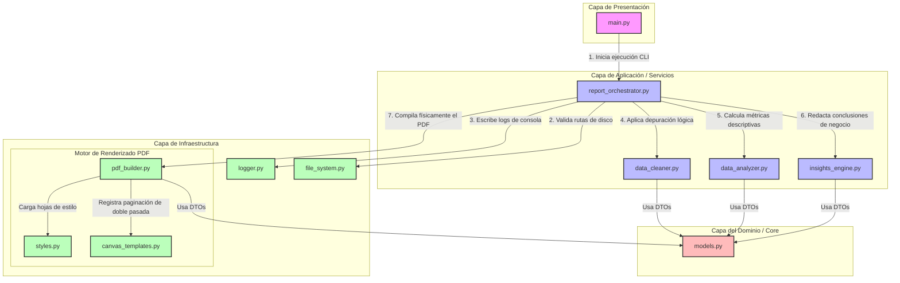

# 📊 Generador Automático de Reportes Empresariales

[](https://www.python.org/)
[](https://pandas.pydata.org/)
[](https://www.reportlab.com/)
[](https://en.wikipedia.org/wiki/Clean_Architecture)
[](https://opensource.org/licenses/MIT)

Un motor analítico empresarial de alto rendimiento desarrollado en **Python** para automatizar el pipeline completo de carga de datos, saneamiento lógico, análisis de calidad de datos, estadísticas cuantitativas de alta precisión y maquetación de informes corporativos en formato PDF con diseño visual de nivel gerencial.

El sistema ha sido estructurado meticulosamente bajo los principios de **Clean Architecture** (Arquitectura Limpia) y **SOLID** (enfocado en el Principio de Responsabilidad Única - SRP). Esto desacopla las reglas de negocio de los detalles de infraestructura (como ReportLab y Pandas), asegurando que el código sea altamente mantenible, extensible y preparado para la integración continua (CI/CD).

---

## 🏗️ Diseño Arquitectónico y Flujo de Datos

El siguiente diagrama de flujo ilustra cómo interactúan las diferentes capas físicas de la aplicación para procesar la información, cumpliendo con la regla de dependencia hacia el interior (el dominio y las reglas de negocio no conocen a ReportLab ni a los controladores del disco):



---

## 🌟 Características Destacadas e Ingeniería de Calidad

### 1. Saneamiento Operativo de Datos (`services/data_cleaner.py`)
*   **Depuración física**: Identifica y elimina registros completamente vacíos (`dropna(how='all')`) sin alterar la fuente original.
*   **Normalización de strings**: Aplica saneamiento a nivel de celda para eliminar espacios en blanco innecesarios e inconsistencias de captura.
*   **Capitalización y homogeneización**: Limpia saltos de línea de las cabeceras de columnas y corrige anomalías para evitar errores de mapeo en Pandas.

### 2. Aritmética Contable de Precisión Fija (`services/data_analyzer.py`)
*   **Cero imprecisiones de hardware**: Los números financieros u operativos no se computan como `float` binarios (los cuales sufren de errores de redondeo de IEEE 754).
*   **Integridad Financiera**: El motor calcula la suma, el promedio, los mínimos y máximos descriptivos y los convierte de manera estricta al tipo **`Decimal` de precisión fija (28 decimales)**. Esto proporciona datos auditables y exactos aptos para áreas contables, ventas y gerencia general.

### 3. Motor de Observaciones Cualitativas (`services/insights_engine.py`)
*   **Diagnóstico de calidad**: Evalúa el porcentaje de completitud física (celdas nulas) y unicidad (registros duplicados).
*   **Insights automatizados**: Redacta de forma dinámica observaciones analíticas y recomendaciones de negocio accionables, indicando las columnas críticas con fallos y los acumulados más relevantes del set de datos.

### 4. Renderizado PDF de Alta Fidelidad (`infrastructure/pdf/`)
*   **Visual Premium**: Paleta corporativa *Slate & Blue* (Azul marino `#1E293B` para cabeceras y portadas, Azul eléctrico `#3B82F6` para acentos, y fondos de tabla gris `#F8FAFC`).
*   **Paginación Dinámica ("Página X de Y")**: Mediante `NumberedCanvas` de doble pasada, el sistema registra el estado de cada página y dibuja dinámicamente pies de página y encabezados con el conteo final de hojas.
*   **Ajuste Proporcional de Columnas**: Calcula dinámicamente el largo de caracteres del dataset para ajustar de manera exacta los anchos de columna al lienzo A4, previniendo solapamientos tipográficos.
*   **Estilo modular e inyectable (`styles.py`)**: Centralización de la tipografía y los `ParagraphStyles` en una clase inyectable, facilitando la personalización estética del reporte.

---

## 📁 Arquitectura Física del Repositorio

La organización modular del repositorio se estructura bajo la siguiente jerarquía limpia:

```text
Generador-de-reportes-automaticos/
├── main.py                         # Punto de acceso principal y CLI de la aplicación
├── config.py                       # Parámetros y constantes visuales globales
├── crear_datos_prueba.py           # Generador de datasets para pruebas (.xlsx y .csv)
├── .gitignore                      # Configuración de exclusiones de control de versiones
├── README.md                       # Documentación técnica principal del sistema
├── core/                           # CAPA DE DOMINIO: Modelos inmutables de datos
│   ├── __init__.py
│   └── models.py                   # DTOs (LimpiezaInfo, EstadisticaNumerica, MetricasReporte)
├── services/                       # CAPA DE APLICACIÓN: Casos de uso de procesamiento
│   ├── __init__.py
│   ├── data_cleaner.py             # Lógica de saneamiento de DataFrames
│   ├── data_analyzer.py            # Computación cuantitativa de alta precisión
│   ├── insights_engine.py          # Lógica analítica del motor de conclusiones
│   └── report_orchestrator.py      # Orquestador del flujo y pipeline analítico
└── infrastructure/                 # CAPA DE INFRAESTRUCTURA: Controladores de tecnologías
    ├── __init__.py
    ├── file_system.py              # Operaciones I/O y prevención de sobreescrituras
    ├── logger.py                   # Interfaz de consola segura para terminales cp1252
    └── pdf/                        # Adaptador ReportLab para maquetado visual
        ├── __init__.py
        ├── styles.py               # Hoja de estilos tipográficos de ReportLab
        ├── canvas_templates.py     # Paginación dinámica en dos pasadas (NumberedCanvas)
        └── pdf_builder.py          # Constructor del layout físico del PDF
```

---

## 🚀 Guía de Instalación y Requisitos

### Requisitos de Sistema
*   **Python 3.10 o superior**
*   Administrador de paquetes `pip`

### 1. Clonar el repositorio
```bash
git clone https://github.com/Braulio2002/Generador-de-reportes-automaticos.git
cd Generador-de-reportes-automaticos
```

### 2. Instalar dependencias
Instala los paquetes analíticos y visuales requeridos:
```bash
pip install pandas openpyxl reportlab xlrd
```

---

## 💻 Instrucciones de Uso y CLI

El script principal expone una interfaz de comandos flexible y robusta:

### Iniciar datos de prueba simulados
Para generar datasets de prueba realistas (con duplicados, vacíos y variables mixtas), ejecuta:
```bash
python crear_datos_prueba.py
```
Esto creará automáticamente los siguientes archivos de demostración en `./datos_entrada/`:
*   `ventas_test.xlsx` (Datos numéricos de ventas)
*   `clientes_test.csv` (Datos de perfiles de usuarios en formato delimitado por comas)

### Ejecutar el pipeline analítico

*   **Procesamiento básico (Excel)**:
    ```bash
    python main.py -i datos_entrada/ventas_test.xlsx
    ```
*   **Procesamiento de archivos CSV**:
    ```bash
    python main.py -i datos_entrada/clientes_test.csv
    ```
*   **Guardar en directorio personalizado**:
    ```bash
    python main.py -i datos_entrada/ventas_test.xlsx -o reportes_gerenciales
    ```

> 💡 **Escaneo Inteligente por Defecto**: Si ejecutas `python main.py` sin argumentos, el motor analizará automáticamente la carpeta `./datos_entrada`, seleccionará el archivo de datos más reciente y procesará su información de forma directa.

---

## 🖥️ Demostración de Salida en Consola

Al ejecutar la herramienta, se despliega una interfaz con banners estéticos limpios, compatible con terminales Windows de codificación restringida (PowerShell/CMD en codificación `cp1252`):

```text
+------------------------------------------------------------------+
|         GENERADOR AUTOMATICO DE REPORTES EMPRESARIALES           |
|         Tecnología de Auditoría de Calidad y Estadísticas        |
+------------------------------------------------------------------+

> Iniciando procesamiento para el archivo: 'ventas_test.xlsx'
> Paso 1: Validando archivo de entrada...
[INFO] Validando archivo de entrada: ventas_test.xlsx...
[ÉXITO] Archivo de entrada validado correctamente.
> Paso 2: Leyendo datos del Excel/CSV...
[INFO] Leyendo datos del archivo...
[ÉXITO] Datos leídos con éxito. Registros iniciales: 15 | Columnas: 7
> Paso 3: Limpiando datos...
[INFO] Limpiando datos...
[ÉXITO] Limpieza completada. Filas vacías eliminadas: 0
> Paso 4: Calculando métricas y análisis cuantitativo...
[INFO] Calculando métricas generales...
[INFO] Analizando estadísticas de columnas numéricas...
[INFO] Generando conclusiones de negocio automatizadas...
> Paso 5: Generando reporte PDF corporativo...
[INFO] Generando reporte PDF...

========================================================================
*** RESUMEN DE PROCESAMIENTO EXITOSO ***
========================================================================
[Archivo] Archivo Procesado:         ventas_test.xlsx
[Registros] Total Registros Analizados:15
[Columnas] Total Columnas:            7
[Limpieza] Filas Vacías Eliminadas:   0
[Reporte] Ruta del PDF Generado:     D:\reportes\reporte_ventas_test.pdf
========================================================================

[ÉXITO] Reporte generado correctamente
[ÉXITO] Proceso finalizado con éxito.
```

---

## 📊 Formato y Distribución Visual del PDF

El reporte corporativo en formato A4 vertical se estructura en 5 páginas con altos estándares estéticos:
1.  **Carátula Empresarial**: Diseñada con una franja de color pizarra, barra decorativa azul, bloque estructurado con los metadatos de auditoría y notas de confidencialidad de uso interno.
2.  **Sección 1 (Resumen Ejecutivo)**: Cuadrícula en formato tarjeta con las estadísticas de volumen y clasificación de variables.
3.  **Sección 2 (Auditoría de Calidad)**: Tabla comparativa con registros vacíos eliminados, nulos remanentes con alerta de columnas críticas y porcentaje de filas duplicadas.
4.  **Sección 3 (Estadísticas Descriptivas)**: Desglose aritmético decimal (Suma, Media, Min, Max) formateado con separadores de miles y decimales.
5.  **Sección 4 (Vista Previa de Datos)**: Muestra de las primeras 10 filas de registros, autolimitando las columnas si el dataset es demasiado ancho.
6.  **Sección 5 (Observaciones & Recomendaciones)**: Bloque que redacta sugerencias operativas para el negocio basadas en el comportamiento de los datos.

---

## 🛠️ Directrices Técnicas y Cumplimiento SOLID

*   **SRP (Principio de Responsabilidad Única)**: Cada archivo realiza una única tarea. El orquestador une las capas pero no sabe cómo se calcula un promedio o cómo se pinta un canvas.
*   **OCP (Principio de Abierto/Cerrado)**: El sistema está diseñado para incorporar nuevos presentadores (como interfaces web en Flask o FastAPIs) o nuevos adaptadores (como exportadores a gráficos matplotlib) simplemente extendiendo la capa de infraestructura.
*   **LSP (Principio de Sustitución de Liskov)**: Las entidades e inyectores respetan las interfaces básicas de tipos de Python sin side effects ocultos.
*   **ISP (Principio de Segregación de Interfaces)**: Las DTOs y modelos se dividen de forma estricta para que los clientes utilicen únicamente los datos que necesitan (ej: `LimpiezaInfo` no interfiere con `EstadisticaNumerica`).
*   **DIP (Principio de Inversión de Dependencias)**: La lógica de cálculo y la limpieza del DataFrame dependen puramente de modelos de dominio inmutables definidos en `core/models.py`.
